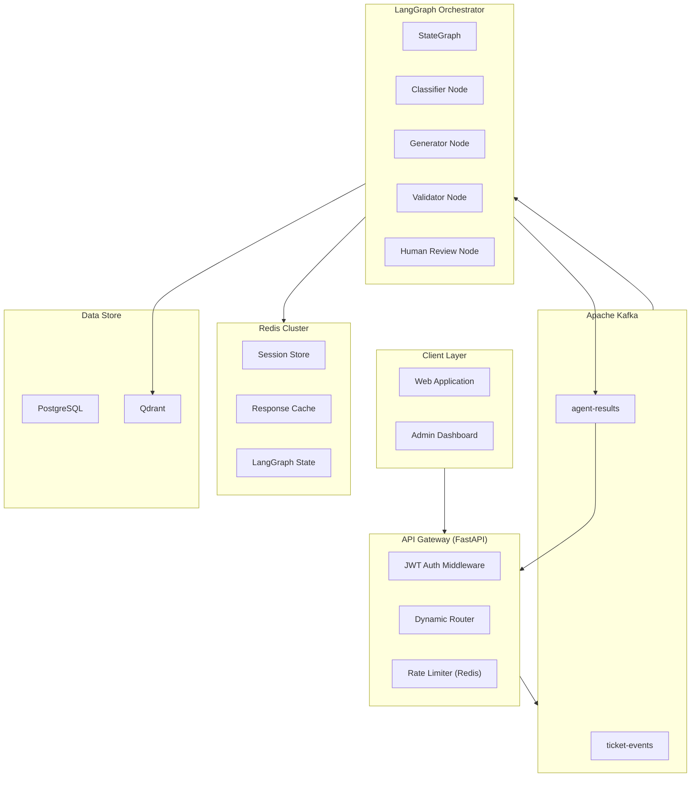
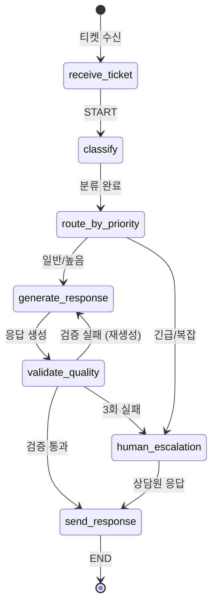
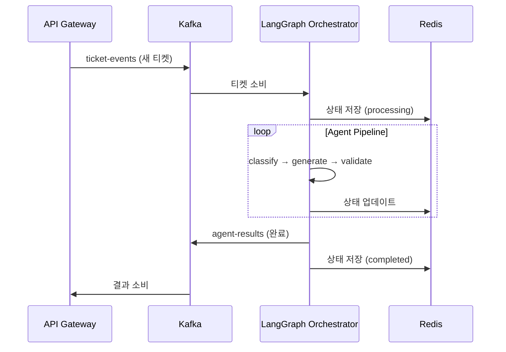

# Multi-AI Agent 고객 지원 자동화 시스템 아키텍처

LangGraph + Kafka + Redis 기반 Multi-AI Agent 시스템으로, 티켓 분류 → 답변 생성 → 품질 검증 파이프라인을 구현합니다.

---

## 시스템 아키텍처 개요



---

## LangGraph 워크플로우 상세

### StateGraph 구조



### LangGraph State 정의

```python
from typing import TypedDict, Literal, Annotated
from langgraph.graph import StateGraph, END

class TicketState(TypedDict):
    # 입력 데이터
    ticket_id: str
    customer_id: str
    content: str
    metadata: dict
    
    # 분류 결과
    category: str
    priority: Literal["low", "medium", "high", "urgent"]
    tags: list[str]
    
    # 생성 결과
    draft_response: str
    context_docs: list[str]
    
    # 검증 결과
    quality_score: float
    quality_feedback: str
    retry_count: int
    
    # 최종 출력
    final_response: str
    status: Literal["pending", "processing", "completed", "escalated"]

# Graph 정의
workflow = StateGraph(TicketState)

# 노드 추가
workflow.add_node("classify", classifier_agent)
workflow.add_node("generate", generator_agent)
workflow.add_node("validate", validator_agent)
workflow.add_node("escalate", human_escalation)
workflow.add_node("respond", send_response)

# 엣지 정의
workflow.set_entry_point("classify")
workflow.add_edge("classify", "generate")
workflow.add_conditional_edges(
    "validate",
    quality_router,
    {
        "pass": "respond",
        "retry": "generate",
        "escalate": "escalate"
    }
)
workflow.add_edge("respond", END)
```

---

## 핵심 컴포넌트 상세

### 1. API Gateway (FastAPI)

```python
# gateway/app/main.py 구조
from fastapi import FastAPI, Depends
from fastapi.middleware.cors import CORSMiddleware

app = FastAPI(title="Customer Support API Gateway")

# 미들웨어
app.add_middleware(RateLimitMiddleware, redis=redis_client)
app.add_middleware(JWTAuthMiddleware)

# 라우트
@app.post("/api/v1/tickets")      # 티켓 생성 → Kafka 발행
@app.get("/api/v1/tickets/{id}")  # 티켓 조회
@app.get("/api/v1/tickets/{id}/status")  # 처리 상태 (Redis)
```

| 엔드포인트 | 메서드 | 설명 |
|-----------|--------|------|
| `/api/v1/auth/login` | POST | JWT 토큰 발급 |
| `/api/v1/tickets` | POST | 티켓 생성 |
| `/api/v1/tickets/{id}` | GET | 티켓 상세 조회 |
| `/api/v1/tickets/{id}/status` | GET | 실시간 처리 상태 |
| `/api/v1/admin/agents` | GET | 에이전트 상태 모니터링 |

---

### 2. Kafka 이벤트 흐름



| Topic | 스키마 | Producer | Consumer |
|-------|--------|----------|----------|
| `ticket-events` | TicketCreatedEvent | Gateway | Orchestrator |
| `agent-results` | AgentResultEvent | Orchestrator | Gateway |
| `dead-letter` | FailedEvent | Any | Admin Service |

---

### 3. Redis 활용 전략

| 용도 | Key Pattern | TTL | 설명 |
|------|-------------|-----|------|
| JWT 세션 | `session:{user_id}` | 24h | 사용자 세션 |
| LangGraph 상태 | `lg:state:{ticket_id}` | 1h | 워크플로우 체크포인트 |
| 응답 캐시 | `cache:resp:{hash}` | 30m | 유사 질문 캐시 |
| Rate Limit | `rate:{user_id}` | 1m | 요청 제한 카운터 |
| 실시간 상태 | `status:{ticket_id}` | 1h | SSE 폴링용 상태 |

---

### 4. AI Agent 상세

#### Classifier Agent
```python
class ClassifierAgent:
    """티켓 분류 에이전트"""
    
    def __call__(self, state: TicketState) -> TicketState:
        # 1. 티켓 내용 분석
        # 2. 카테고리 분류 (billing, technical, general, complaint)
        # 3. 우선순위 결정 (low, medium, high, urgent)
        # 4. 관련 태그 추출
        return updated_state
```

#### Generator Agent
```python
class GeneratorAgent:
    """답변 생성 에이전트 (RAG 기반)"""
    
    def __call__(self, state: TicketState) -> TicketState:
        # 1. Vector DB에서 유사 문서 검색
        # 2. 컨텍스트 + 티켓 내용으로 프롬프트 구성
        # 3. LLM으로 답변 초안 생성
        return updated_state
```

#### Validator Agent
```python
class ValidatorAgent:
    """품질 검증 에이전트"""
    
    def __call__(self, state: TicketState) -> TicketState:
        # 1. 응답 품질 점수 (0-1)
        # 2. 정책 준수 확인
        # 3. 톤/매너 검증
        # 4. Pass/Retry/Escalate 결정
        return updated_state
```

---

## 프로젝트 구조

```
multi-agent/
├── docker-compose.yml           # Kafka, Redis, PostgreSQL, Qdrant
├── .env.example
│
├── gateway/                     # API Gateway
│   ├── app/
│   │   ├── main.py
│   │   ├── auth/               # JWT 인증
│   │   ├── routes/             # 라우트 정의
│   │   └── middleware/         # Rate Limit 등
│   ├── requirements.txt
│   └── Dockerfile
│
├── orchestrator/                # LangGraph Orchestrator
│   ├── app/
│   │   ├── main.py             # Kafka Consumer
│   │   ├── graph/
│   │   │   ├── state.py        # TicketState 정의
│   │   │   ├── workflow.py     # StateGraph 정의
│   │   │   └── nodes.py        # 노드 함수들
│   │   ├── agents/
│   │   │   ├── classifier.py
│   │   │   ├── generator.py
│   │   │   └── validator.py
│   │   └── prompts/            # 프롬프트 템플릿
│   ├── requirements.txt
│   └── Dockerfile
│
├── shared/                      # 공유 라이브러리
│   ├── kafka_client.py
│   ├── redis_client.py
│   ├── models.py               # Pydantic 모델
│   └── config.py
│
└── infra/                       # 인프라 설정
    ├── kafka/
    ├── redis/
    └── qdrant/
```

---

## 기술 스택

| 레이어 | 기술 | 버전 |
|--------|------|------|
| **Language** | Python | 3.11+ |
| **API Framework** | FastAPI | 0.109+ |
| **Agent Framework** | LangGraph | 0.0.40+ |
| **LLM** | OpenAI GPT-4 / Claude | - |
| **Message Broker** | Apache Kafka | 3.6+ |
| **Cache/State** | Redis | 7.2+ |
| **Vector DB** | Qdrant | 1.7+ |
| **Database** | PostgreSQL | 16+ |
| **Container** | Docker + Compose | - |

---

## 구현 순서

### Phase 1: 인프라 (Day 1-2)
1. Docker Compose 설정 (Kafka, Redis, PostgreSQL, Qdrant)
2. 공유 라이브러리 (Kafka/Redis 클라이언트)

### Phase 2: API Gateway (Day 3-4)
3. FastAPI Gateway 기본 구조
4. JWT 인증 미들웨어
5. Rate Limiting (Redis 기반)

### Phase 3: LangGraph Orchestrator (Day 5-8)
6. TicketState 및 워크플로우 정의
7. Classifier Agent 구현
8. Generator Agent 구현 (RAG)
9. Validator Agent 구현
10. Kafka Consumer 연동

### Phase 4: 통합 및 테스트 (Day 9-10)
11. End-to-End 테스트
12. 모니터링 설정

---

## Verification Plan

```bash
# 1. 인프라 테스트
docker-compose up -d
docker-compose ps

# 2. API Gateway 테스트
curl -X POST http://localhost:8000/api/v1/auth/login
curl -X POST http://localhost:8000/api/v1/tickets -H "Authorization: Bearer ..."

# 3. LangGraph 워크플로우 테스트
pytest orchestrator/tests/ -v
```
